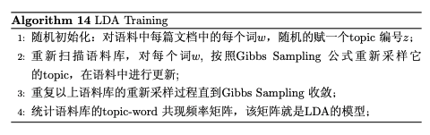
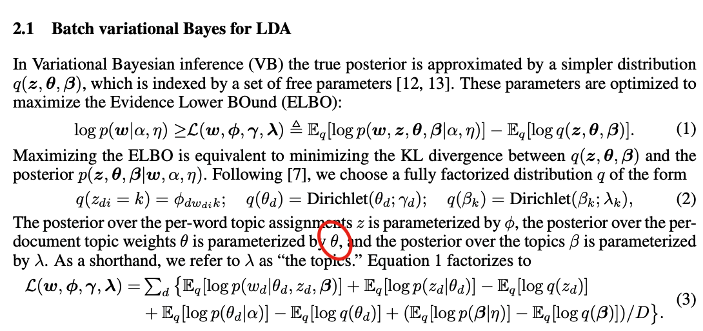
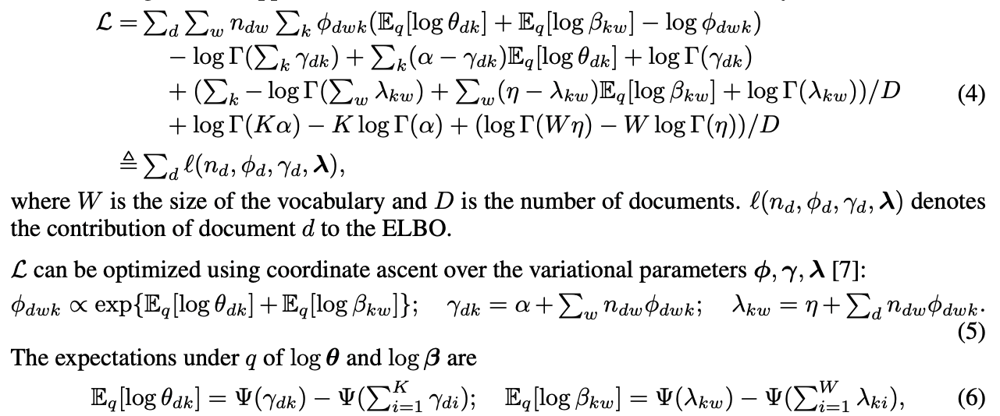
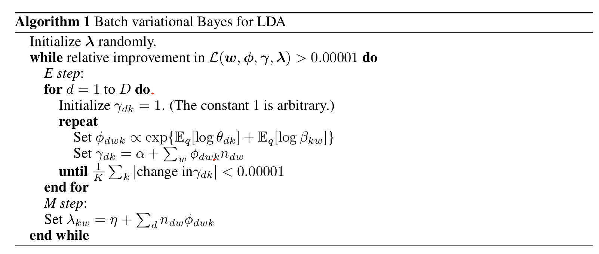
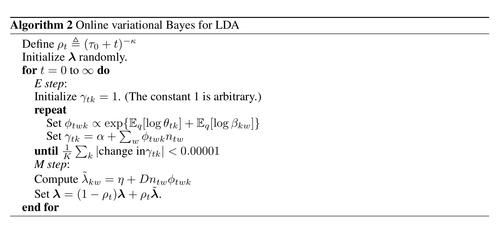
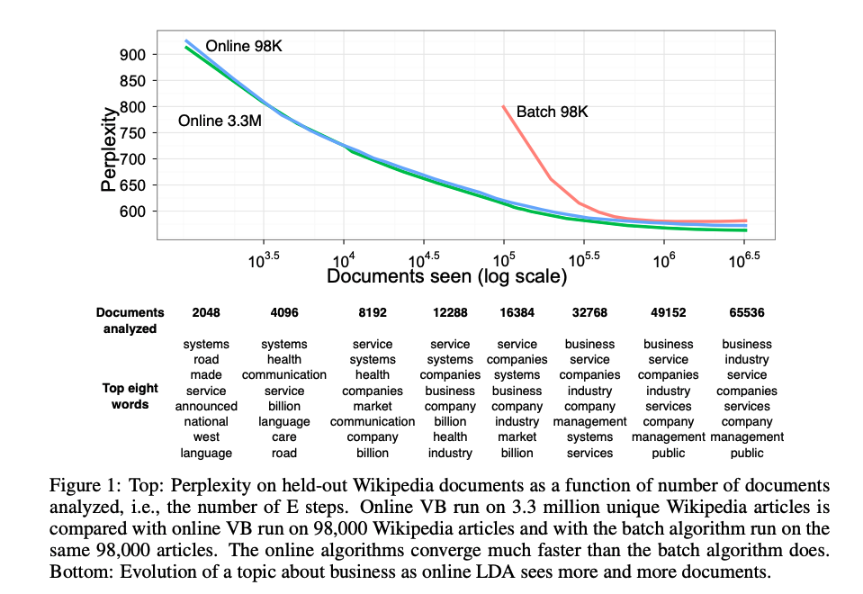
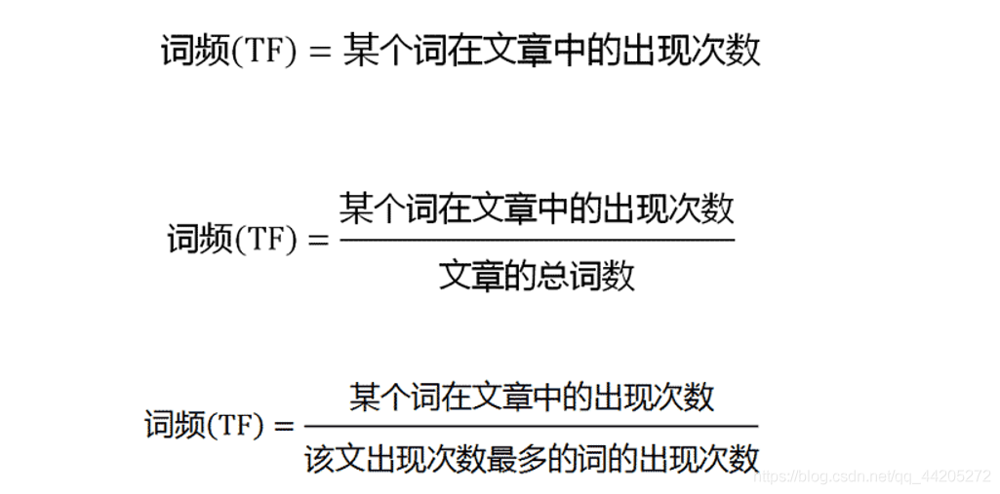
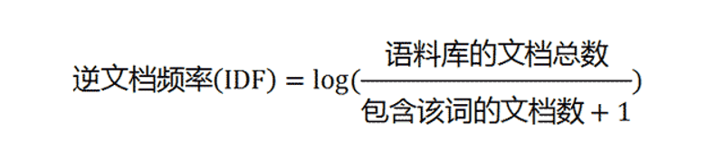

# Online LDA主题模型算法分享

汇报人:唐馨乐

Available at https://github.com/SmartDataLab/LDA-Share


---

## 追星时间


**Matt Hoffman**(google)
- SVI随机变分推断（2013）之父
- Stan（2015）共同创始人
- Online Learning for LDA(2010 NIPS SVI原型)
- 在tensorflow中引入distributions、prob等子包
(:thinking: 可以说搞深度学习的贝叶斯学家都得靠他的工具吃饭,SVI相当于贝叶斯里的随机梯度下降)
---

## 算法原理Online LDA






$$
p\left(z_{i}=k \mid \overrightarrow{\mathbf{z}}_{\neg i}, \overrightarrow{\mathbf{w}}\right) \propto \frac{n_{m, \neg i}^{(k)}+\alpha_{k}}{\sum_{k=1}^{K}\left(n_{m, \neg i}^{(t)}+\alpha_{k}\right)} \cdot \frac{n_{k, \neg i}^{(t)}+\beta_{t}}{\sum_{t=1}^{V}\left(n_{k, \neg i}^{(t)}+\beta_{t}\right)}
$$
- 后验概率估计
    - :cry:MCMC(马氏链无法并行和增量)
    - :smile:Variantional Baysian(NIPS 1999)
        - ELBO(Max)+EM(Min KL)
- 关键点E步没有显式解
    - E步需要使用全量数据迭代到收敛
    - Online:smile:使用部分数据(batch)迭代

---
## 伪代码 BatchVB



---
## 伪代码 OnlineVB




---

## 代码上的直观差异

```python
for i in range(max_iter):
    if learning_method == "online":
        for idx_slice in gen_batches(n_samples, batch_size):
            self._em_step(
                X[idx_slice, :],
                total_samples=n_samples,
                batch_update=False,
                parallel=parallel,
            )
    else:
        # batch update
        self._em_step(
            X, total_samples=n_samples, batch_update=True, parallel=parallel
        )
```

---

## 时间复杂度分析



- MCMC
- BatchVB
- OnlineVB

---

## 具体实现-词袋化处理与稀疏矩阵

  



---

## 具体实现-模型参数初始化

```python
    def _init_latent_vars(self, n_features):
        """Initialize latent variables."""
        self.random_state_ = check_random_state(self.random_state)
        self.n_batch_iter_ = 1
        self.n_iter_ = 0
        if self.doc_topic_prior is None:
            self.doc_topic_prior_ = 1.0 / self.n_components
        else:
            self.doc_topic_prior_ = self.doc_topic_prior
        if self.topic_word_prior is None:
            self.topic_word_prior_ = 1.0 / self.n_components
        else:
            self.topic_word_prior_ = self.topic_word_prior
        init_gamma = 100.0
        init_var = 1.0 / init_gamma
        # In the literature, this is called `lambda`
        self.components_ = self.random_state_.gamma(
            init_gamma, init_var, (self.n_components, n_features)
        )
        # In the literature, this is `exp(E[log(beta)])`
        self.exp_dirichlet_component_ = np.exp(
            _dirichlet_expectation_2d(self.components_)
        )


```


---

## 具体实现-模型学习:EM-step

- E步(模型推理只需要这一步，实际含义都相当于后验概率)
$$
\phi_{d w k} \propto \exp \left\{\mathbb{E}_{q}\left[\log \theta_{d k}\right]+\mathbb{E}_{q}\left[\log \beta_{k w}\right]\right\} ; \quad \gamma_{d k}=\alpha+\sum_{w} n_{d w} \phi_{d w k}
$$

$$
\mathbb{E}_{q}\left[\log \theta_{d k}\right]=\Psi\left(\gamma_{d k}\right)-\Psi\left(\sum_{i=1}^{K} \gamma_{d i}\right) ; \quad \mathbb{E}_{q}\left[\log \beta_{k w}\right]=\Psi\left(\lambda_{k w}\right)-\Psi\left(\sum_{i=1}^{W} \lambda_{k i}\right)
$$

- M步

$$\quad \lambda_{k w}=\eta+\sum_{d} n_{d w} \phi_{d w k}$$

---

### E步

```python
def _update_doc_distribution(
    X,
    exp_topic_word_distr,
    doc_topic_prior,
    max_doc_update_iter,
    mean_change_tol,
    cal_sstats,
    random_state,
):
    is_sparse_x = sp.issparse(X)
    n_samples, n_features = X.shape
    n_topics = exp_topic_word_distr.shape[0]

    if random_state:
        doc_topic_distr = random_state.gamma(100.0, 0.01, (n_samples, n_topics))
    else:
        doc_topic_distr = np.ones((n_samples, n_topics))

    # In the literature, this is `exp(E[log(theta)])`
    exp_doc_topic = np.exp(_dirichlet_expectation_2d(doc_topic_distr))


```

---

```python
    # diff on `component_` (only calculate it when `cal_diff` is True)
    suff_stats = np.zeros(exp_topic_word_distr.shape) if cal_sstats else None
    if is_sparse_x:
        X_data = X.data
        X_indices = X.indices
        X_indptr = X.indptr

    for idx_d in range(n_samples):
        if is_sparse_x:
            ids = X_indices[X_indptr[idx_d] : X_indptr[idx_d + 1]]
            cnts = X_data[X_indptr[idx_d] : X_indptr[idx_d + 1]]
        else:
            ids = np.nonzero(X[idx_d, :])[0]
            cnts = X[idx_d, ids]

        doc_topic_d = doc_topic_distr[idx_d, :]
        # The next one is a copy, since the inner loop overwrites it.
        exp_doc_topic_d = exp_doc_topic[idx_d, :].copy()
        exp_topic_word_d = exp_topic_word_distr[:, ids]
```

---

```python
        # Iterate between `doc_topic_d` and `norm_phi` until convergence
        for _ in range(0, max_doc_update_iter):
            last_d = doc_topic_d

            # The optimal phi_{dwk} is proportional to
            # exp(E[log(theta_{dk})]) * exp(E[log(beta_{dw})]).
            norm_phi = np.dot(exp_doc_topic_d, exp_topic_word_d) + EPS

            doc_topic_d = exp_doc_topic_d * np.dot(cnts / norm_phi, exp_topic_word_d.T)
            # Note: adds doc_topic_prior to doc_topic_d, in-place.
            _dirichlet_expectation_1d(doc_topic_d, doc_topic_prior, exp_doc_topic_d)

            if mean_change(last_d, doc_topic_d) < mean_change_tol:
                break
        doc_topic_distr[idx_d, :] = doc_topic_d

        # Contribution of document d to the expected sufficient
        # statistics for the M step.
        if cal_sstats:
            norm_phi = np.dot(exp_doc_topic_d, exp_topic_word_d) + EPS
            suff_stats[:, ids] += np.outer(exp_doc_topic_d, cnts / norm_phi)
```

---

### M步

```python
        # M-step
        if batch_update:
            self.components_ = self.topic_word_prior_ + suff_stats
        else:
            # online update
            # In the literature, the weight is `rho`
            weight = np.power(
                self.learning_offset + self.n_batch_iter_, -self.learning_decay
            )
            doc_ratio = float(total_samples) / X.shape[0]
            self.components_ *= 1 - weight
            self.components_ += weight * (
                self.topic_word_prior_ + doc_ratio * suff_stats
            )
        # update `component_` related variables
        self.exp_dirichlet_component_ = np.exp(
            _dirichlet_expectation_2d(self.components_)
        )


```
---

## 具体实现-模型评估:Perplexity

```python
        def _loglikelihood(prior, distr, dirichlet_distr, size):
            # calculate log-likelihood
            score = np.sum((prior - distr) * dirichlet_distr)
            score += np.sum(gammaln(distr) - gammaln(prior))
            score += np.sum(gammaln(prior * size) - gammaln(np.sum(distr, 1)))
            return score
        dirichlet_doc_topic = _dirichlet_expectation_2d(doc_topic_distr)
        dirichlet_component_ = _dirichlet_expectation_2d(self.components_)
        doc_topic_prior = self.doc_topic_prior_
        topic_word_prior = self.topic_word_prior_
        # E[log p(docs | theta, beta)]
        for idx_d in range(0, n_samples):
            if is_sparse_x:
                ids = X_indices[X_indptr[idx_d] : X_indptr[idx_d + 1]]
                cnts = X_data[X_indptr[idx_d] : X_indptr[idx_d + 1]]
            else:
                ids = np.nonzero(X[idx_d, :])[0]
                cnts = X[idx_d, ids]
            temp = (
                dirichlet_doc_topic[idx_d, :, np.newaxis] + dirichlet_component_[:, ids]
            )
            norm_phi = logsumexp(temp, axis=0)
            score += np.dot(cnts, norm_phi)
        # compute E[log p(theta | alpha) - log q(theta | gamma)]
        score += _loglikelihood(
            doc_topic_prior, doc_topic_distr, dirichlet_doc_topic, self.n_components
        )


```

---

## 具体实现-并行化加速

- numpy外部库加速
    - 模型内性质:K个主题、词袋长度、多利用矩阵运算
- 算法实现上加速(sklearn)
    - batch内(sklearn现有支持,一个节点，一个进程，并行线程)
- 硬件级加速
    - batch外(多个batch收集梯度集中更新,也是能收敛,多节点多进程)

---

```python
        # TODO: make Parallel._effective_n_jobs public instead?
        n_jobs = effective_n_jobs(self.n_jobs)
        if parallel is None:
            parallel = Parallel(n_jobs=n_jobs, verbose=max(0, self.verbose - 1))
        results = parallel(
            delayed(_update_doc_distribution)(
                X[idx_slice, :],
                self.exp_dirichlet_component_,
                self.doc_topic_prior_,
                self.max_doc_update_iter,
                self.mean_change_tol,
                cal_sstats,
                random_state,
            )
            for idx_slice in gen_even_slices(X.shape[0], n_jobs)
        )
```


---

## 参考

- sklearn-LDA源码 https://github.com/scikit-learn/scikit-learn/blob/7e1e6d09b/sklearn/decomposition/_lda.py#L141
- "Online Learning for Latent Dirichlet Allocation", Matthew D.
           Hoffman, David M. Blei, Francis Bach, 2010(NIPS)
           https://github.com/blei-lab/onlineldavb
- "Stochastic Variational Inference", Matthew D. Hoffman,
           David M. Blei, Chong Wang, John Paisley, 2013
- LDA数学八卦 https://bloglxm.oss-cn-beijing.aliyuncs.com/lda-LDA%E6%95%B0%E5%AD%A6%E5%85%AB%E5%8D%A6.pdf

